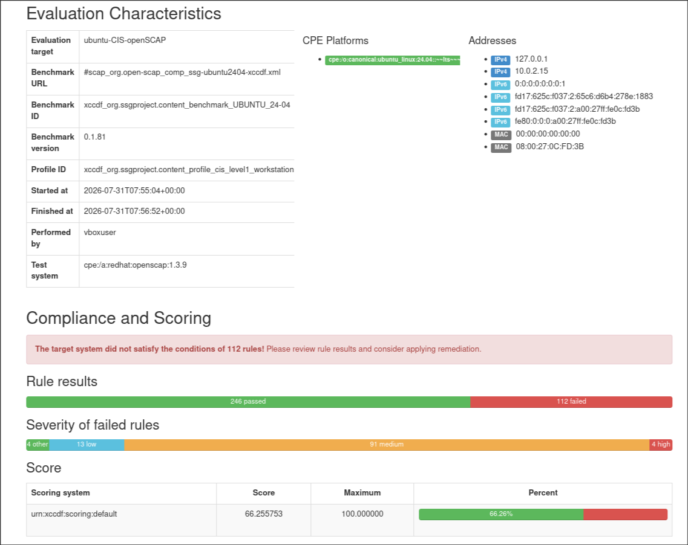
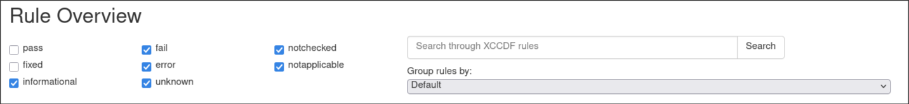
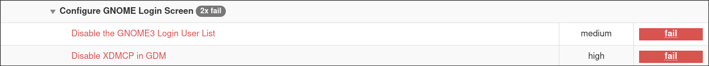
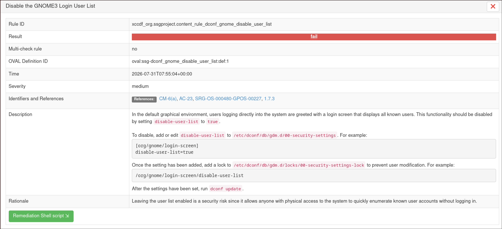
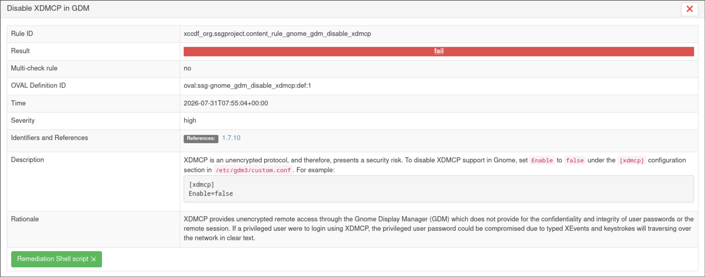
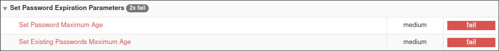
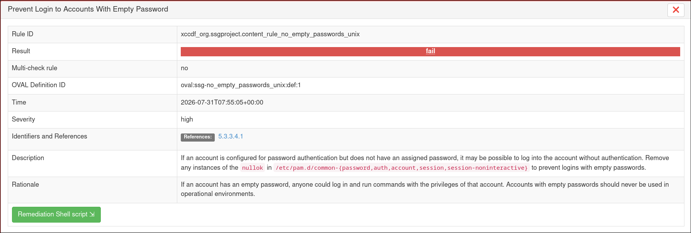
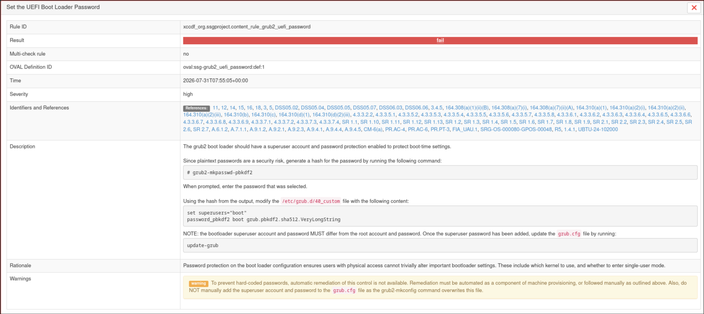
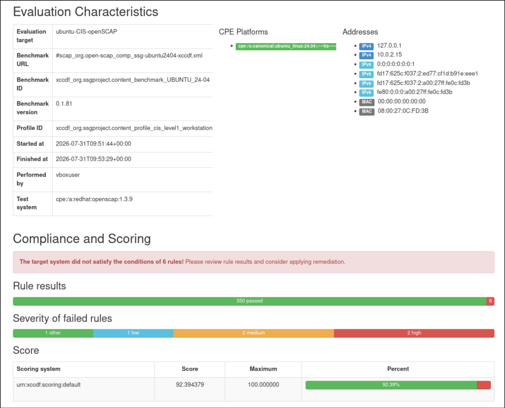

# CIS benchmarks
The [CIS Benchmarks](https://www.cisecurity.org/cis-benchmarks-overview)are community-developed secure configuration recommendations for hardening organizations and technologies against cyber attacks. Mapped to the CIS Critical Security Controls (CIS Controls), the CIS Benchmarks elevate the security defenses for cloud provider platforms and cloud services, containers, databases, desktop software, server software, mobile devices, network devices, and operating systems. They also help organizations demonstrate (in this report we will be focusing on the CIS benchmarks for operating systems specificaly **ubuntu 24.04 LTS**)

***do note that we have two types of benchmarks availabale***
- STIG
- CIS(which i will reffer to as the normal version)
## STIG vs CIS: The Key Differences
### Baseline Functionality

  STIGs often provide a more military-focused baseline, given their DoD origins. CIS Benchmarks offer broader functionality that can be applied across different industries. Both aim for an industry-standard approach that’s accessible to information security and operations teams.
### Endpoint Security

  STIG compliance often leans towards securing specific endpoint configurations on Windows 10 and other operating systems, while CIS controls focus on a broader range of security controls that are not just tied to endpoints. For example, you’ll find Linux distributions like Ubuntu and Red Hat Enterprise Linux well represented in both ecosystems, with hardening guidance that can be automated and kept current.

## system specifications and installation 
the system used for this test practice is the ubuntu 24.04 LTS 

> in order to install openSCAP on a ubuntu 22.04 system we use :
>
> `sudo apt update && sudo apt install openscap-scanner `
>> some systems might not have the package , instead we install:
>>
>>`sudo apt install libopenscap25t64` (or other reffered packages)
>
>to check instalation we use `oscap --version`

> now that we have the scanner and the profiles installed we can check our profile listing with the:
>
> `ls /usr/share/xml/scap/ssg/content/ ` command.
>
>we should see multiple profiles listed in the terminal  

## aditional profile installation

**however** for this case our profiles have been taken from the github page sourced in the openSCAP website that you can find [here](https://github.com/ComplianceAsCode/content/releases)

here we can see the different releases for the security profles in this report we will be using the following command to get the latest ssg(scap security guide ) we need for the ubuntu 24.04 system
> ``sudo apt install wget unzip``
>
>``wget https://github.com/ComplianceAsCode/content/releases/download/v0.1.81/scap-security-guide-0.1.81.zip``
>
>`unzip scap-security-guide-0.1.81.zip -d ssg-content`
>
and in order to check and get information our ubuntu 24 ssg's
>`sudo oscap info ssg-content/scap-security-guide-0.1.81/ssg-ubuntu2404-ds.xml | tee ~/oscapinfo.txt`
> or alternatively :
> `ls /home/username/ssg-content/scap-security-guide-0.1.81` here we can see all the profiles and use `oscap info ` on each one 

## profile selection
in order to select our profile from the various ssg's provided in the oscapinfo.txt file we can read the description of each profile
``` h
  	Ref-Id: scap_org.open-scap_cref_ssg-ubuntu2404-xccdf.xml
		Status: draft
		Generated: 2026-06-01
		Resolved: true
		Profiles:
			Title: CIS Ubuntu Linux 24.04 LTS Benchmark for Level 1 - Server
				Id: xccdf_org.ssgproject.content_profile_cis_level1_server
			Title: CIS Ubuntu Linux 24.04 LTS Benchmark for Level 1 - Workstation
				Id: xccdf_org.ssgproject.content_profile_cis_level1_workstation
			Title: CIS Ubuntu Linux 24.04 LTS Benchmark for Level 2 - Server
				Id: xccdf_org.ssgproject.content_profile_cis_level2_server
			Title: CIS Ubuntu Linux 24.04 LTS Benchmark for Level 2 - Workstation
				Id: xccdf_org.ssgproject.content_profile_cis_level2_workstation
			Title: Canonical Ubuntu 24.04 LTS Security Technical Implementation Guide (STIG) V1R1
```

for this report i will be using the **Title: CIS Ubuntu Linux 24.04 LTS Benchmark for Level 1 - Workstation** with the corresponding Id :
``hxccdf_org.ssgproject.content_profile_cis_level1_workstation``

### profile evaluation
in order to evaluate our system against the selected profile we run the following command that generates two report files 
>`sudo oscap xccdf eval --profile -hxccdf_org.ssgproject.content_profile_cis_level1_workstation -results ~/ssg-results.xml --report ~/ssg-report.html ssg-content/scap-security-guide-0.1.81/ssg-ubuntu2404-ds.xml`
>the last part of this command can be replaced with the path to your data stream file that i have also put in the req folder in this repo

one is an ssg-results.xml file and a very nice ***ss-results.html*** file that we will be using from now on 


in this file we can see what our system was tested against and what scores it got and what vunerabilities it has how severe they are and other information 

more information about the test profile can be viewed in the evaluation charecterstics section 

#   results
At first glance we can see the results and how many the system passed or failed 

in this case we passed **246** and failed **112** lets go through the some failed cases and their severity :
(we can filter the html webpage to display only the failed cases )



but before that lets see what are the different types of results we can get  

## types of faliure:

do note that we have different types of results:
- pass : Compliant: Your system’s configuration fully complies with the security requirements of this rule.
- fail : Non-compliant , Your system did not meet the requirements of this rule and requires security remediation.
- fixed : Remediated This rule initially failed during the scan, but the automated remediation script successfully applied the fix.
- Error: The scanner encountered an issue while evaluating this rule (e.g., insufficient file permissions or a bug in the rule definition).
- informational : This rule is intended strictly for gathering system information and is not evaluated as a pass or fail metric.
- unknown : The scanner executed completely but could not determine a definitive result (pass or fail) for this rule.
- Not Evaluated: This rule was not evaluated by the automated tool. This status is typically displayed for rules that require a manual audit by a system administrator.
- Not Applicable: This rule does not apply to your current environment and was ignored (e.g., a rule for securing the Apache web server when Apache is not installed on your system).

### Configure GNOME Login Screen 

here we have 2 erors one of which is high and one is medium

1. Disable the GNOME3 Login User List (medium)

by clicking on either one we can see their description , what they mean and what the fix is 



here for example the fail is suggesting that we have to remove the function to see all other users on
the system and has provided us with the bash shell script 

2. Disable XDMCP in GDM (high)



- here it is sugesting that we disable xdmcp with the reasoning being that XDMCP provides unencrypted remote access through the Gnome Display Manager (GDM) which does not provide for the confidentiality and integrity of user passwords or the remote session. If a privileged user were to login using XDMCP, the privileged user password could be compromised due to typed XEvents and keystrokes will traversing over the network in clear text.

### Set Account Password Expiration Parameters and Features 


- another medium risk compromise that is also practiced by many comapnies and is existant in many cybersecurity practices is the password age limit meaning passwords need to be changed periodicly both for new users and users that already exist 

- Any password, no matter how complex, can eventually be cracked. Therefore, passwords need to be changed periodically. If the operating system does not limit the lifetime of passwords and force users to change their passwords, there is the risk that the operating system passwords could be compromised.

- Setting the password maximum age ensures users are required to periodically change their passwords. Requiring shorter password lifetimes increases the risk of users writing down the password in a convenient location subject to physical compromise.

- a **high risk** associated compromise with passwords is the users having the ability to login to an account that has no password set 



If an account has an empty password, anyone could log in and run commands with the privileges of that account. Accounts with empty passwords should never be used in operational environments.

### GRUB2 and UEFI bootloader configuration 


here its telling us that grub2 needs to have a superuser that has a secure password so the boot time settings cant be changed and is requiring us to set a hashed password for grub2 

**NOTE** : this error will be reuccuring again down the road and the reason is very simple with it being that we need to manually set a password on our grub2 *or anywhere in our system in general* and the script did not genrate the pasword for us and as you can see left the remedy script section empty

# Remediation
after the inittal check and evaluation of our system openSCAP will generate a remedy script file with the following command :

> `sudo oscap xccdf generate fix --profile hxccdf_org.ssgproject.content_profile_cis_level1_workstation --fix-type bash --output ~/remediation.sh ssg-content/scap-security-guide-0.1.81/ssg-ubuntu2404-ds.xml`

which will generate a bash script named **remediation.sh** that we can run with 
```bash
sudo bash remediation.sh 
``` 
or alternativeley:

>`sudo oscap xccdf eval --profile hxccdf_org.ssgproject.content_profile_cis_level1_workstation --remediate --results ~/ssg-remediated-results.xml --report ~/ssg-remediated-report.html ssg-content/scap-security-guide-0.1.81/ssg-ubuntu2404-ds.xml`

that also remakes the result .html and .xml files again (do note that this process may take 5-15 minutes depending on your system a good way to check if it hasnt frozen is by runnig a `btop` command in the terminal and checking the proccess list)

# Post Remediation Results

after the remedy script has completed we can check for another result file with the previously mentioned commnads.



this time we can see that we have only 6 test cases 2 of which previously mentioned were the grub2 and uefi passwords that were high in severity and need manual intervertion lets inspect the others more closely and see why they still remain 

## Ensure /tmp Located On Separate Partition(low)

- The /tmp partition is used as temporary storage by many programs. Placing /tmp in its own partition enables the setting of more restrictive mount options, which can help protect programs which use it. Ensure it has its own partition or logical volume at installation time, or migrate it using LVM.

- the reason the bash file didnt fix this was the fact that modifying disk partitions on a live, running system is highly complex and poses a massive risk of data loss or system corruption. and also the fact that The script does not know if we are using standard partitions, LVM (Logical Volume Manager), or BTRFS. A one-size-fits-all bash script cannot safely navigate these different filesystem architectures.

## Ensure nftables Default Deny Firewall Policy(medium)
- Base chain policy is the default verdict that will be applied to packets reaching the end of the chain. There are two policies: accept (Default) and drop. If the policy is set to accept, the firewall will accept any packet that is not configured to be denied and the packet will continue traversing the network stack. Run the following commands and verify that base chains contain a policy of DROP. 

- It is easier to allow acceptable usage than to block unacceptable usage. 

## limit user ssh access
- By default, the SSH configuration allows any user with an account to access the system. There are several options available to limit which users and group can access the system via SSH. It is recommended that at least one of the following options be leveraged: - AllowUsers variable gives the system administrator the option of allowing specific users to ssh into the system. The list consists of space separated user names. Numeric user IDs are not recognized with this variable. If a system administrator wants to restrict user access further by specifically allowing a user's access only from a particular host, the entry can be specified in the form of user@host. - AllowGroups variable gives the system administrator the option of allowing specific groups of users to ssh into the system. The list consists of space separated group names. Numeric group IDs are not recognized with this variable. - DenyUsers variable gives the system administrator the option of denying specific users to ssh into the system. The list consists of space separated user names. Numeric user IDs are not recognized with this variable. If a system administrator wants to restrict user access further by specifically denying a user's access from a particular host, the entry can be specified in the form of user@host. - DenyGroups variable gives the system administrator the option of denying specific groups of users to ssh into the system. The list consists of space separated group names. Numeric group IDs are not recognized with this variable.
