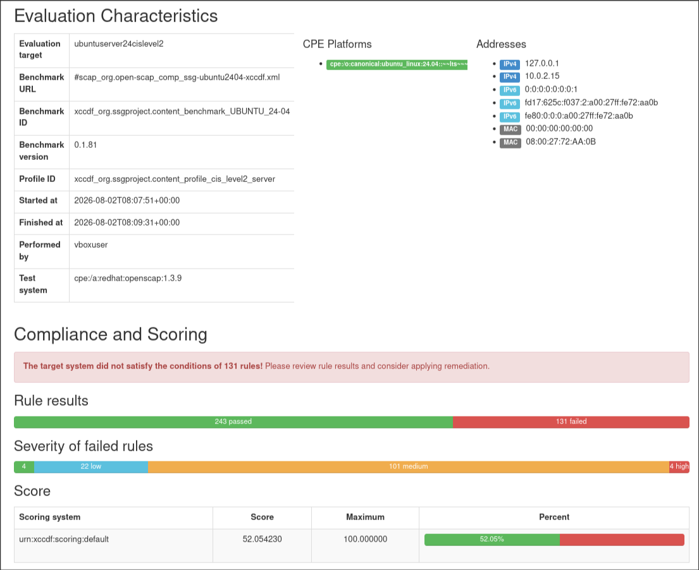
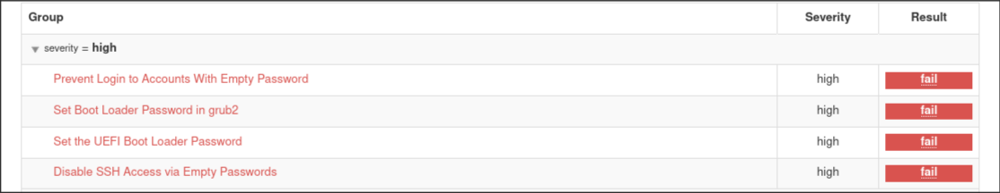
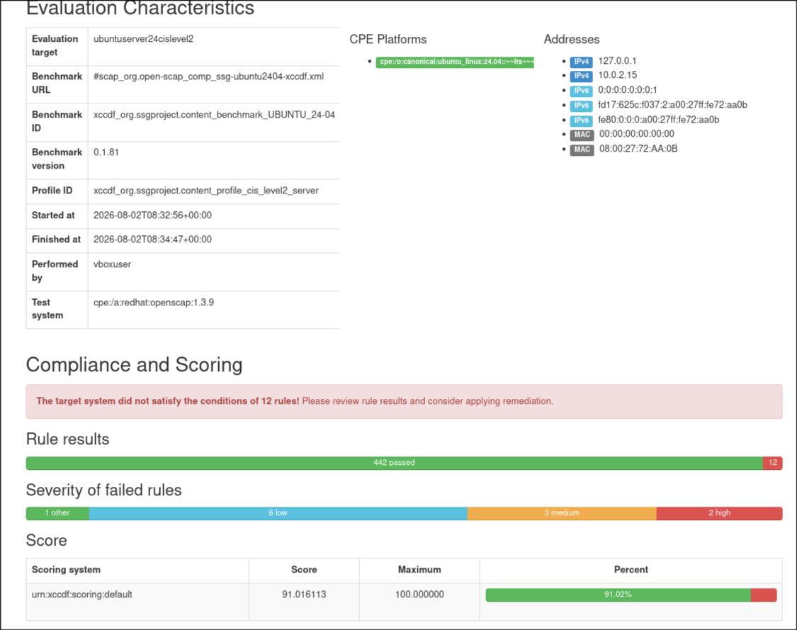
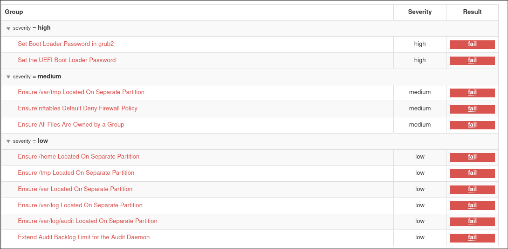

# CIS level 2 ubuntu server 24.04 
following the previous report on ubuntu 24 workspace that was hardened up to level 1 using CIS standards and openSCAP in this report we will be hardening the server version up to level 2 

we will be following the same genral steps with the different profile :
> `xccdf_org.ssgproject.content_profile_cis_level2_server` will be our profile 

folowing the steps mentioned in the previous report we will get 3 set of files :
 - the pre-remedy .html and .xml files
 - the remedy script .sh file
 - the post-remedy .html and .xml files

 in this report i automated the proccess and ran the setup.sh to get the files and extract them from github and the proc.sh to : 
 1. evaluate the system before the remedy
 2. generate and apply the remedy (that takes 5-15 minutes)
 3. re-evaluate th system after the remediation

 ## initial report (pre remedy)
 

 here we can see that the system failed **131** tests of which **4** had a high severity earning the score of **52 out of 100**

 

here we can see the classic UEFI and GRUB2 not having a password and the user ssh and login without password that need manual intervertion 
other than that we can see that in the level 2 version every main root folders like /tmp /home / var and ... need to be on their own partition for better security and redundancy 

and some other ones worth mentioning like : uninstalling rsync , disabling root ssh login capability , ssh login attempt limit , ...

## secondary report (post remedy)

here after the remedy we can see the system failed only **12** tests of which **2** had a high severity an earning the score of **91 out of 100**

 

which  all mostly all need manual fixing like the GRUB passwords and partioning the root folders 
one that the script could do but didnt was the firewall policy that if fixed might have resulted in being locked out of the sysytem if connected to it 
- Ensure nftables Default Deny Firewall Policy

 Base chain policy is the default verdict that will be applied to packets reaching the end of the chain. There are two policies: accept (Default) and drop. If the policy is set to accept, the firewall will accept any packet that is not configured to be denied and the packet will continue traversing the network stack. Run the following commands and verify that base chains contain a policy of DROP.
